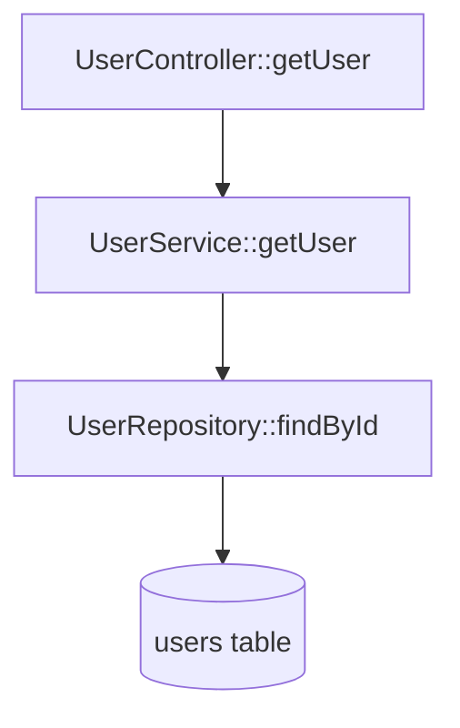

# 使用指南

本文档提供代码影响分析工具的详细使用说明和最佳实践。

## 目录

- [快速开始](#快速开始)
- [详细用法](#详细用法)
- [输出格式详解](#输出格式详解)
- [实际案例](#实际案例)
- [最佳实践](#最佳实践)
- [常见问题](#常见问题)

## 快速开始

### 第一次使用

1. **准备工作空间**

   确保你的代码库组织在一个工作空间目录下：
   
   ```
   my-workspace/
   ├── service-a/
   ├── service-b/
   └── service-c/
   ```

2. **生成 patch 文件**

   对于单个项目：
   ```bash
   # 从 Git 提交生成 patch
   git diff HEAD~1 > changes.patch
   
   # 或从两个分支之间的差异
   git diff main feature-branch > changes.patch
   ```
   
   对于多个项目（推荐）：
   ```bash
   # 为每个项目生成独立的 patch 文件
   mkdir patches
   
   # 在 project_a 目录下
   cd project_a
   git diff HEAD~1 > ../patches/project_a.patch
   
   # 在 project_b 目录下
   cd ../project_b
   git diff HEAD~1 > ../patches/project_b.patch
   ```
   
   **重要**: Patch 文件名（去掉 .patch 扩展名）必须与 workspace 中的项目目录名一致。例如：`project_a.patch` 对应 `workspace/project_a/` 目录。

3. **运行分析**

   对于多个 patch 文件（推荐）：
   ```bash
   code-impact-analyzer \
     --workspace my-workspace \
     --diff patches \
     --output impact.dot
   ```
   
   对于单个 patch 文件：
   ```bash
   code-impact-analyzer \
     --workspace my-workspace \
     --diff changes.patch \
     --output impact.dot
   ```

4. **可视化结果**

   ```bash
   # 安装 Graphviz（如果还没有）
   # Ubuntu/Debian: sudo apt-get install graphviz
   # macOS: brew install graphviz
   
   # 生成图像
   dot -Tpng impact.dot -o impact.png
   ```

## 详细用法

### 命令行参数完整说明

#### 必需参数

**`--workspace <PATH>`**

指定包含所有项目源代码的工作空间根目录。

```bash
--workspace /home/user/projects/my-workspace
```

工具会递归扫描此目录下的所有源文件。

**`--diff <PATH>`**

指定 Git patch 文件目录路径，包含以项目命名的多个 .patch 文件。

```bash
--diff /tmp/patches
```

目录结构示例：
```
patches/
├── project_a.patch    # 对 project_a 的修改
├── project_b.patch    # 对 project_b 的修改
└── project_c.patch    # 对 project_c 的修改
```

工具会自动扫描目录中的所有 .patch 文件并逐个解析。

也支持传入单个 .patch 文件路径以保持向后兼容：
```bash
--diff /tmp/changes.patch
```

#### 可选参数

**`--output-format <FORMAT>`**

指定输出格式，默认为 `dot`。

可选值：
- `dot`: Graphviz DOT 格式（默认）
- `json`: JSON 格式
- `mermaid`: Mermaid 图表格式

```bash
--output-format json
```

**`--output <PATH>`**

指定输出文件路径。如果不指定，输出到标准输出。

```bash
--output /tmp/impact-graph.dot
```

**`--max-depth <N>`**

限制调用链追溯的最大深度，默认为 10。

```bash
--max-depth 5
```

深度说明：
- 深度 1: 只追溯直接调用者/被调用者
- 深度 3: 适合快速分析
- 深度 5-10: 适合大多数场景
- 深度 >10: 可能导致分析时间过长

**`--log-level <LEVEL>`**

设置日志级别，默认为 `info`。

可选值：
- `error`: 只显示错误
- `warn`: 显示警告和错误
- `info`: 显示主要信息（默认）
- `debug`: 显示详细调试信息

```bash
--log-level debug
```

### 环境变量

**`RAYON_NUM_THREADS`**

控制并行处理的线程数。

```bash
# 使用 8 个线程
RAYON_NUM_THREADS=8 code-impact-analyzer --workspace . --diff changes.patch
```

**`RUST_LOG`**

更细粒度的日志控制（覆盖 `--log-level`）。

```bash
# 只显示特定模块的日志
RUST_LOG=code_impact_analyzer::parser=debug code-impact-analyzer ...
```

## 输出格式详解

### DOT 格式详解

DOT 格式是 Graphviz 的标准图描述语言。

#### 节点样式


#### 边样式

```dot
// 方法调用 - 实线
"ServiceA::method" -> "ServiceB::method" [style=solid];

// HTTP 调用 - 虚线
"ServiceA::method" -> "GET:/api/users" [style=dashed];

// Kafka 消息 - 点线
"ServiceA::method" -> "user-events" [style=dotted];

// 数据库操作 - 粗线
"ServiceA::method" -> "users" [style=bold];

// Redis 操作 - 双线
"ServiceA::method" -> "user:*" [style=double];
```

#### 渲染选项

```bash
# PNG 格式，高 DPI
dot -Tpng -Gdpi=300 impact.dot -o impact.png

# SVG 格式（可缩放）
dot -Tsvg impact.dot -o impact.svg

# PDF 格式
dot -Tpdf impact.dot -o impact.pdf

# 使用不同的布局算法
neato -Tpng impact.dot -o impact.png  # 力导向布局
circo -Tpng impact.dot -o impact.png  # 环形布局
fdp -Tpng impact.dot -o impact.png    # 力导向布局（更快）
```

### JSON 格式详解

JSON 格式提供完整的结构化数据，便于程序化处理。

#### 完整示例

```json
{
  "nodes": [
    {
      "id": "com.example.UserService::getUser",
      "type": "Method",
      "metadata": {
        "file": "service-a/src/main/java/com/example/UserService.java",
        "line_start": 42,
        "line_end": 58,
        "class": "UserService",
        "method": "getUser",
        "parameters": ["Long id"]
      }
    },
    {
      "id": "GET:/api/users/{id}",
      "type": "HttpEndpoint",
      "metadata": {
        "method": "GET",
        "path": "/api/users/{id}",
        "path_params": ["id"]
      }
    },
    {
      "id": "user-events",
      "type": "KafkaTopic",
      "metadata": {
        "topic": "user-events"
      }
    },
    {
      "id": "users",
      "type": "DatabaseTable",
      "metadata": {
        "table": "users",
        "schema": "public"
      }
    },
    {
      "id": "user:*",
      "type": "RedisPrefix",
      "metadata": {
        "prefix": "user:",
        "pattern": "user:*"
      }
    }
  ],
  "edges": [
    {
      "from": "com.example.UserController::getUser",
      "to": "com.example.UserService::getUser",
      "type": "MethodCall",
      "direction": "Downstream",
      "metadata": {
        "line": 25
      }
    },
    {
      "from": "com.example.UserController::getUser",
      "to": "GET:/api/users/{id}",
      "type": "HttpCall",
      "direction": "Upstream",
      "metadata": {
        "framework": "Spring"
      }
    }
  ],
  "cycles": [
    {
      "nodes": ["ServiceA::methodX", "ServiceB::methodY", "ServiceA::methodX"],
      "length": 2
    }
  ],
  "statistics": {
    "total_nodes": 156,
    "total_edges": 234,
    "node_types": {
      "Method": 120,
      "HttpEndpoint": 15,
      "KafkaTopic": 8,
      "DatabaseTable": 10,
      "RedisPrefix": 3
    },
    "edge_types": {
      "MethodCall": 180,
      "HttpCall": 30,
      "KafkaProduceConsume": 16,
      "DatabaseReadWrite": 20,
      "RedisReadWrite": 6
    },
    "cycles_detected": 1,
    "max_depth_reached": 8
  },
  "metadata": {
    "workspace": "/home/user/projects/my-workspace",
    "patch_file": "changes.patch",
    "analysis_time_ms": 12543,
    "files_processed": 1234,
    "files_failed": 3,
    "warnings": 5
  }
}
```

#### 使用 JSON 输出

**使用 jq 查询**:

```bash
# 提取所有方法节点
jq '.nodes[] | select(.type == "Method")' impact.json

# 统计各类型节点数量
jq '.statistics.node_types' impact.json

# 查找特定方法的所有调用者
jq '.edges[] | select(.to == "com.example.Service::method")' impact.json

# 提取所有循环依赖
jq '.cycles' impact.json
```

**使用 Python 处理**:

```python
import json

with open('impact.json') as f:
    data = json.load(f)

# 查找所有 HTTP 接口
http_endpoints = [
    node for node in data['nodes'] 
    if node['type'] == 'HttpEndpoint'
]

# 构建调用图
call_graph = {}
for edge in data['edges']:
    if edge['type'] == 'MethodCall':
        if edge['from'] not in call_graph:
            call_graph[edge['from']] = []
        call_graph[edge['from']].append(edge['to'])

# 分析影响范围
print(f"Total impacted methods: {len(call_graph)}")
```

### Mermaid 格式详解

Mermaid 格式可以直接在 Markdown 文档中渲染。

#### 示例输出

```mermaid
graph TD
    A[UserController::getUser] -->|calls| B[UserService::getUser]
    B -->|calls| C[UserRepository::findById]
    C -->|reads| D[(users table)]
    B -->|reads| E{{user:cache:*}}
    A -->|provides| F[/GET:/api/users/{id}/]
    B -->|produces| G[/user-events topic/]
    
    style A fill:#e1f5ff
    style B fill:#e1f5ff
    style C fill:#e1f5ff
    style D fill:#f0f0f0
    style E fill:#ffe1e1
    style F fill:#e1ffe1
    style G fill:#fff4e1
```

#### 在文档中使用

**GitHub/GitLab Markdown**:

````markdown
# 影响分析报告

## 变更影响范围



## 说明

此次变更影响了用户查询链路...
````

## 实际案例

### 案例 1: 分析多项目 API 变更影响

**场景**: 在一个包含多个微服务的工作空间中，修改了多个服务的代码，需要了解整体影响范围。

**步骤**:

1. 为每个项目生成 patch 文件：
   ```bash
   mkdir patches
   
   cd user-service
   git diff main feature/update-user-api > ../patches/user-service.patch
   
   cd ../order-service
   git diff main feature/update-order-api > ../patches/order-service.patch
   
   cd ../payment-service
   git diff main feature/update-payment-api > ../patches/payment-service.patch
   ```

2. 运行分析：
   ```bash
   code-impact-analyzer \
     --workspace ~/projects/microservices \
     --diff patches \
     --output-format json \
     --output multi-service-impact.json
   ```

3. 查看影响的服务：
   ```bash
   jq '.nodes[] | select(.type == "HttpEndpoint")' multi-service-impact.json
   ```

4. 生成可视化报告：
   ```bash
   code-impact-analyzer \
     --workspace ~/projects/microservices \
     --diff patches \
     --output-format mermaid \
     --output multi-service-impact.mmd
   ```

**结果**: 发现跨服务的调用链路，识别出需要协调更新的服务。

### 案例 2: 分析单个服务的 API 变更影响

**场景**: 修改了用户服务的 `getUser` 方法，需要了解影响范围。

**步骤**:

1. 生成 patch 文件：
   ```bash
   git diff main feature/update-user-api > user-api-changes.patch
   ```

2. 运行分析：
   ```bash
   code-impact-analyzer \
     --workspace ~/projects/microservices \
     --diff user-api-changes.patch \
     --output-format json \
     --output user-api-impact.json
   ```

3. 查看影响的服务：
   ```bash
   jq '.nodes[] | select(.type == "HttpEndpoint")' user-api-impact.json
   ```

4. 生成可视化报告：
   ```bash
   code-impact-analyzer \
     --workspace ~/projects/microservices \
     --diff user-api-changes.patch \
     --output-format mermaid \
     --output user-api-impact.mmd
   ```

**结果**: 发现 3 个下游服务调用了该 API，需要同步更新。

### 案例 3: 分析数据库表变更影响

**场景**: 需要修改 `users` 表结构，评估影响范围。

**步骤**:

1. 创建模拟 patch（添加新字段）：
   ```bash
   # 修改 schema 文件
   git diff > schema-changes.patch
   ```

2. 运行分析：
   ```bash
   code-impact-analyzer \
     --workspace ~/projects/microservices \
     --diff schema-changes.patch \
     --max-depth 15 \
     --output db-impact.dot
   ```

3. 可视化：
   ```bash
   dot -Tpng db-impact.dot -o db-impact.png
   ```

4. 查找所有读写该表的方法：
   ```bash
   code-impact-analyzer \
     --workspace ~/projects/microservices \
     --diff schema-changes.patch \
     --output-format json | \
     jq '.edges[] | select(.to == "users")'
   ```

**结果**: 识别出 15 个方法读写该表，需要评估兼容性。

### 案例 4: 分析 Kafka Topic 变更影响

**场景**: 修改了 `user-events` Topic 的消息格式。

**步骤**:

1. 生成 patch：
   ```bash
   git diff > event-format-changes.patch
   ```

2. 运行分析：
   ```bash
   code-impact-analyzer \
     --workspace ~/projects/microservices \
     --diff event-format-changes.patch \
     --output-format json \
     --output kafka-impact.json
   ```

3. 查找所有消费者：
   ```bash
   jq '.edges[] | select(.to == "user-events" and .type == "KafkaProduceConsume")' \
     kafka-impact.json
   ```

**结果**: 发现 4 个服务消费该 Topic，需要协调升级。

## 最佳实践

### 1. 工作空间组织

**推荐结构**:

```
workspace/
├── service-a/
│   ├── src/
│   ├── config/
│   └── pom.xml
├── service-b/
│   ├── src/
│   ├── Cargo.toml
│   └── config/
└── shared-lib/
    └── src/
```

**建议**:
- 将所有相关服务放在同一个工作空间
- 保持一致的目录结构
- 包含配置文件目录

### 2. Patch 文件生成

**推荐方式（多项目）**:

```bash
# 创建 patches 目录
mkdir patches

# 为每个项目生成独立的 patch 文件
cd project_a
git diff main..feature-branch > ../patches/project_a.patch

cd ../project_b
git diff main..feature-branch > ../patches/project_b.patch

cd ../project_c
git diff main..feature-branch > ../patches/project_c.patch
```

**重要**: 
- Patch 文件名（去掉 .patch 扩展名）必须与 workspace 中的项目目录名一致
- 例如：`project_a.patch` 对应 `workspace/project_a/` 目录
- 工具会自动将 patch 中的文件路径添加项目名前缀

**单个项目方式**:

```bash
# 分析特定提交
git show <commit-hash> > changes.patch

# 分析分支差异
git diff main..feature-branch > changes.patch

# 分析未提交的变更
git diff HEAD > changes.patch

# 分析暂存区变更
git diff --cached > changes.patch
```

**避免**:
- 不要包含二进制文件变更
- 避免过大的 patch 文件（建议单个文件 < 10MB）
- 确保 patch 文件名与项目名对应（多项目场景）

### 3. 深度设置

根据分析目标选择合适的深度：

| 场景 | 推荐深度 | 说明 |
|------|---------|------|
| 快速影响评估 | 3-5 | 只看直接影响 |
| 常规分析 | 5-10 | 平衡性能和完整性 |
| 完整影响分析 | 10-15 | 追溯完整链路 |
| 大型代码库 | 3-5 | 避免性能问题 |

### 4. 输出格式选择

| 格式 | 适用场景 |
|------|---------|
| DOT | 需要高质量可视化图像 |
| JSON | 需要程序化处理或自定义分析 |
| Mermaid | 需要在文档中嵌入图表 |

### 5. 性能优化

**大型代码库**:

```bash
# 限制深度
--max-depth 5

# 增加并行度
RAYON_NUM_THREADS=16 code-impact-analyzer ...

# 只分析必要的子集
--workspace ~/projects/microservices/core-services
```

**内存优化**:

```bash
# 减少日志输出
--log-level error

# 分批处理多个 patch
for patch in *.patch; do
    code-impact-analyzer --workspace . --diff "$patch" --output "${patch%.patch}.dot"
done
```

### 6. 持续集成

**在 CI/CD 中使用**:

```yaml
# .github/workflows/impact-analysis.yml
name: Impact Analysis

on:
  pull_request:
    branches: [ main ]

jobs:
  analyze:
    runs-on: ubuntu-latest
    steps:
      - uses: actions/checkout@v2
        with:
          fetch-depth: 0
      
      - name: Generate patch
        run: git diff origin/main...HEAD > changes.patch
      
      - name: Run impact analysis
        run: |
          code-impact-analyzer \
            --workspace . \
            --diff changes.patch \
            --output-format mermaid \
            --output impact.mmd
      
      - name: Comment PR
        uses: actions/github-script@v6
        with:
          script: |
            const fs = require('fs');
            const impact = fs.readFileSync('impact.mmd', 'utf8');
            github.rest.issues.createComment({
              issue_number: context.issue.number,
              owner: context.repo.owner,
              repo: context.repo.repo,
              body: `## Impact Analysis\n\n\`\`\`mermaid\n${impact}\n\`\`\``
            });
```

## 常见问题

### Q1: 为什么某些方法调用没有被追溯到？

**可能原因**:
1. 使用了反射或动态代理
2. 跨语言调用（如 JNI）
3. 深度限制过小
4. 方法名称解析失败

**解决方案**:
- 增加 `--max-depth` 值
- 检查日志中的警告信息
- 手动补充动态调用关系

### Q2: 分析速度很慢怎么办？

**优化方法**:
1. 减小深度限制
2. 增加并行线程数
3. 只分析必要的项目子集
4. 使用更快的存储设备

### Q3: 如何处理循环依赖？

**识别循环**:

```bash
# JSON 格式输出包含循环信息
jq '.cycles' impact.json
```

**处理建议**:
- 重构代码消除循环依赖
- 在图中标记循环以便识别
- 使用深度限制避免无限追溯

### Q4: 支持哪些 HTTP 框架？

**当前支持**:
- Java: Spring Boot, Spring MVC
- Rust: Axum

**扩展支持**:
可以通过实现 `LanguageParser` trait 添加新框架支持。

### Q5: 如何分析配置文件中的动态值？

**限制**:
工具只能识别静态配置值，无法处理：
- 环境变量引用
- 运行时计算的值
- 加密的配置

**建议**:
- 使用配置管理工具生成完整配置
- 手动补充动态配置的影响关系

### Q6: 输出的图太大无法查看？

**解决方案**:

1. 减小深度限制
2. 使用 JSON 格式进行程序化分析
3. 使用 Graphviz 的交互式查看器：
   ```bash
   xdot impact.dot
   ```
4. 分层分析：
   ```bash
   # 先分析直接影响
   code-impact-analyzer --max-depth 2 ...
   
   # 再深入分析特定分支
   code-impact-analyzer --max-depth 10 ...
   ```

### Q7: 如何在团队中共享分析结果？

**推荐方式**:

1. **生成 Mermaid 格式嵌入文档**:
   ```bash
   code-impact-analyzer --output-format mermaid > impact.mmd
   # 添加到 PR 描述或设计文档
   ```

2. **生成 PNG 图像**:
   ```bash
   code-impact-analyzer --output impact.dot
   dot -Tpng impact.dot -o impact.png
   # 上传到 Wiki 或文档系统
   ```

3. **生成 JSON 供工具处理**:
   ```bash
   code-impact-analyzer --output-format json > impact.json
   # 导入到分析工具或仪表板
   ```

## 更多资源

- [README.md](README.md) - 项目概述和快速开始
- [GitHub Issues](https://github.com/your-repo/issues) - 报告问题和功能请求
- [示例项目](examples/) - 完整的使用示例

## 反馈

如有问题或建议，欢迎：
- 提交 GitHub Issue
- 发送邮件至 [待定]
- 参与讨论 [待定]
